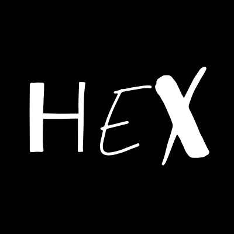

 

  <a href="https://hexcapes.qzz.io">
    
    <h3 align="center">Hex Server</h3>
  </a>

The backend service used by Hex

  <a href="https://dsc.gg/hexcapes"><strong>Community</strong></a> ·
  <a href="https://hexcapes.qzz.io"><strong>Catalog</strong></a> ·
  <a href="https://hexcapes.qzz.io/uptime"><strong>Uptime</strong></a> ·
  <a href="https://github.com/SaaranshDx/Hex-server/tree/main/docs"><strong>Docs</strong></a>

 